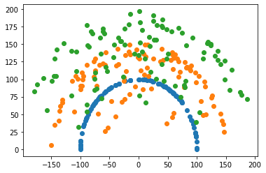

# Imitation-Learning

Forward kinematics is the procedure to calculate end-effector coordinates (xn,yn) by using theta1, theta2 etc. Forward kinematics is usually straight forward to calculate and mostly involes linear combinations of trignometric terms.

On the other hand inverse kinematics involves calculating theta1, theta2 ... thetan from the end-effector position. This is a mcuh harder probelm and it is highly non-linear. 

This project involves using deep learning to fit a neural net on the non-linear inverse kinematics hyper plane using the forward kinematics as our input data. 
 



## Getting Started

These instructions will get you a copy of the project up and running on your local machine for development and testing purposes. See deployment for notes on how to deploy the project on a live system.

### Prerequisites

This project uses Pytorch for deep learning. Using a GPU for training is ideal but the project supplies pre-trained networks that can be used.


### Installing

#### For mac
##### using conda
```
conda install matplotlib
conda install pandas
conda install pytorch torchvision torchaudio -c pytorch
```
##### using pip
```
python -m pip3 install -U matplotlib
pip3 install pandas
pip3 install torch torchvision torchaudio
```

## Background

Explain how to run the automated tests for this system

### Break down into end to end tests

Explain what these tests test and why

```
Give an example
```

### And coding style tests

Explain what these tests test and why

```
Give an example
```

## Deployment

Add additional notes about how to deploy this on a live system

## Built With

* [Dropwizard](http://www.dropwizard.io/1.0.2/docs/) - The web framework used
* [Maven](https://maven.apache.org/) - Dependency Management
* [ROME](https://rometools.github.io/rome/) - Used to generate RSS Feeds

## Contributing

Please read [CONTRIBUTING.md](https://gist.github.com/PurpleBooth/b24679402957c63ec426) for details on our code of conduct, and the process for submitting pull requests to us.

## Versioning

We use [SemVer](http://semver.org/) for versioning. For the versions available, see the [tags on this repository](https://github.com/your/project/tags). 

## Authors

* **Billie Thompson** - *Initial work* - [PurpleBooth](https://github.com/PurpleBooth)

See also the list of [contributors](https://github.com/your/project/contributors) who participated in this project.

## License

This project is licensed under the MIT License - see the [LICENSE.md](LICENSE.md) file for details

## Acknowledgments

* Hat tip to anyone whose code was used
* Inspiration
* etc
