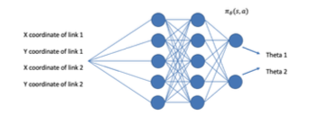
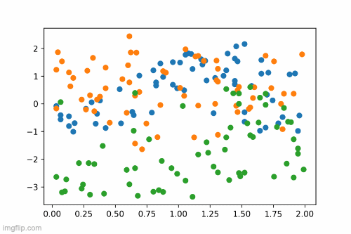

# Imitation-Learning

Forward kinematics is the procedure to calculate end-effector coordinates (xn,yn) by using theta1, theta2 etc. Forward kinematics is usually straight forward to calculate and mostly involes linear combinations of trignometric terms.

On the other hand inverse kinematics involves calculating theta1, theta2 ... thetan from the end-effector position. This is a mcuh harder probelm and it is highly non-linear. 

This project involves using deep learning to fit a neural net on the non-linear inverse kinematics hyper plane using the forward kinematics as our input data. 
 


## Getting Started

These instructions will get you a copy of the project up and running on your local machine for development and testing purposes. See deployment for notes on how to deploy the project on a live system.

### Prerequisites

This project uses Pytorch for deep learning. Using a GPU for training is ideal but the project supplies pre-trained networks that can be used.


### Installing

#### For mac
##### using conda
```
conda install matplotlib
conda install pandas
conda install pytorch torchvision torchaudio -c pytorch
```
##### using pip
```
python -m pip3 install -U matplotlib
pip3 install pandas
pip3 install torch torchvision torchaudio
```

## Background

The motion planning environment involves a 3-link robotic arm. The dataset to train and test the model was created using random inputs of joint angles θ1 and θ2. Based on the input joint angles, the end-effector positions were calculated using forward kinematics equations. This data collection was used to validate the model performance. The input to the deep neural network is the position coordinates of the two arm linkages, and the output are the linkage angles θ1 and θ2 to reach the pre-calculated end-effector position. Deep neural network architecture:



## Results

## Built With

* [Dropwizard](http://www.dropwizard.io/1.0.2/docs/) - The web framework used
* [Maven](https://maven.apache.org/) - Dependency Management
* [ROME](https://rometools.github.io/rome/) - Used to generate RSS Feeds


## Authors

* **Gautam Sharma** - *Github* - [gsharma](https://github.com/gautam-sharma1)


## License

This project is licensed under the MIT License - see the [LICENSE.md](LICENSE.md) file for details


